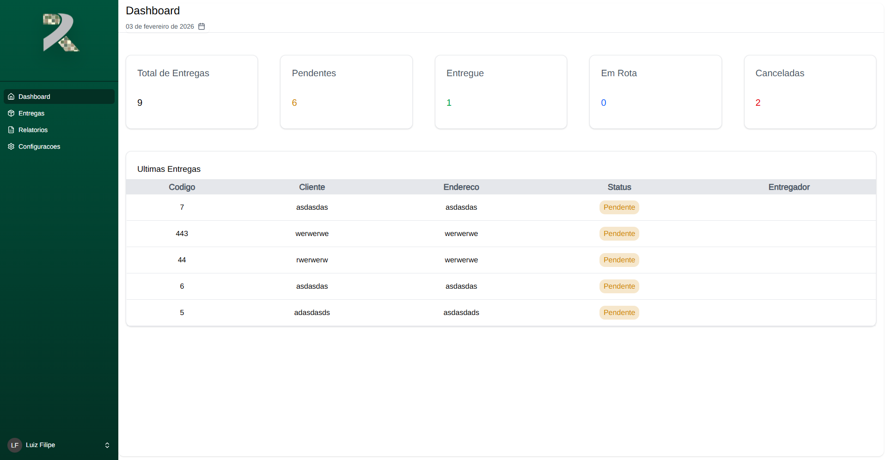

# Revest Interno – Sistema de Gestão de Entregas 🚚
## Meu Primeiro projeto fullstack para usuario reais
  
  
  
  

**Revest Interno** é um sistema web para **gestão de entregas de uma loja**, permitindo cadastro, edição, finalização e acompanhamento detalhado das entregas em tempo real.

---
## 🔎 Sobre

O projeto tem como objetivo facilitar a gestão logística de entregas da loja, permitindo aos funcionários e gestores:

Criar novas entregas

Editar informações de entregas existentes

Finalizar entregas

Acompanhar o status das entregas

Filtrar entregas por entregador, data, status, entre outros

O sistema usa Laravel para o backend, React + Inertia.js no frontend, e TailwindCSS para estilização moderna e responsiva.

---

## 🧠 Tecnologias

- **Backend:** PHP 8+ com Laravel  
- **Frontend:** React + Inertia.js + TypeScript  
- **Estilização:** TailwindCSS  
- **Ferramentas de Build:** Vite  
- **Controle de estado:** React Hooks  

---

## 📸 Screenshots

  
  
Pagina de Login

  
  
Dashboard

  
  
Entregas

  
Relatorios (ainda em desenvolvimento) 

  
  
Configuracoes

---

